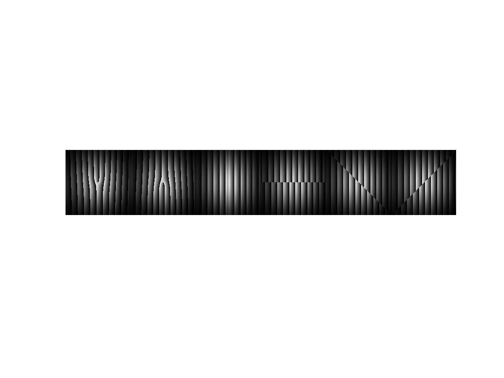
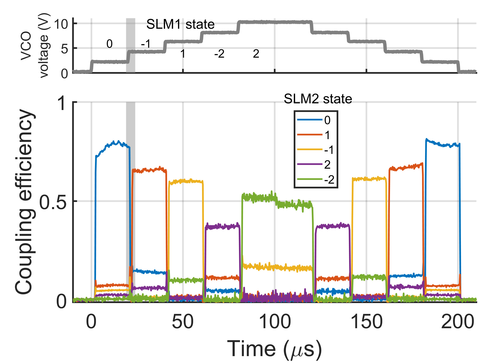
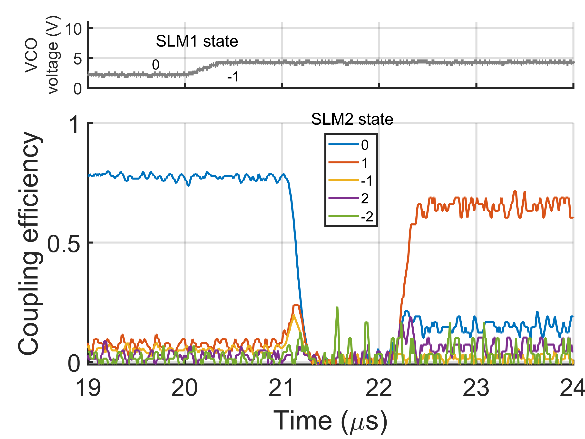

# Fast Optical Mode Sorting and Generation

Check out the [paper](https://opg.optica.org/oe/fulltext.cfm?uri=oe-28-20-29112&id=439700)! ([PDF version](http://www.boydnlo.ca/wp-content/uploads/2020/09/oe-28-20-29112.pdf))

## Overview

I worked on this project over summer 2019 in Robert Boyd's lab at uOttawa, in collaboration with Alex Skerjanc and Boris Braverman.

